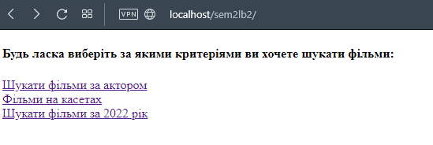
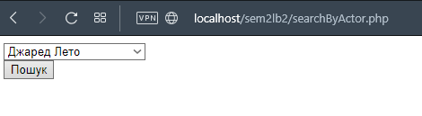
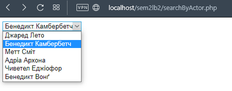
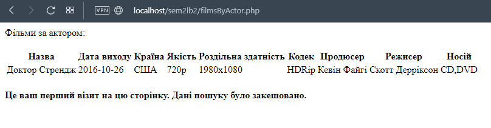
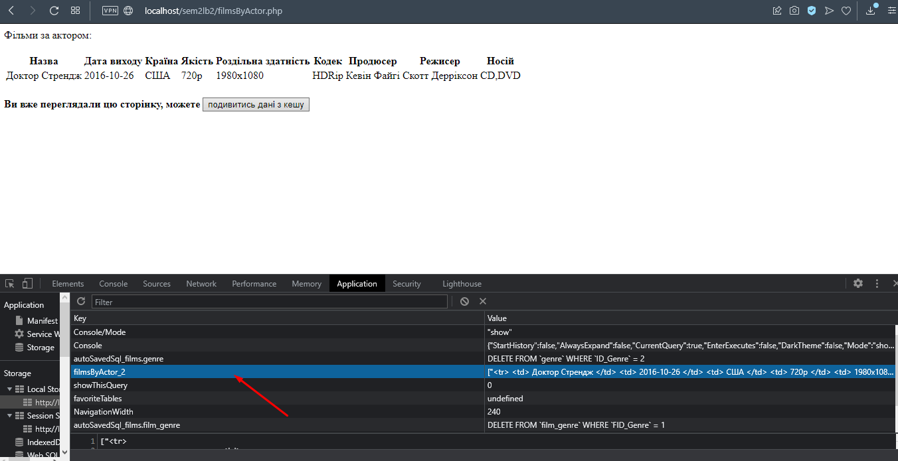
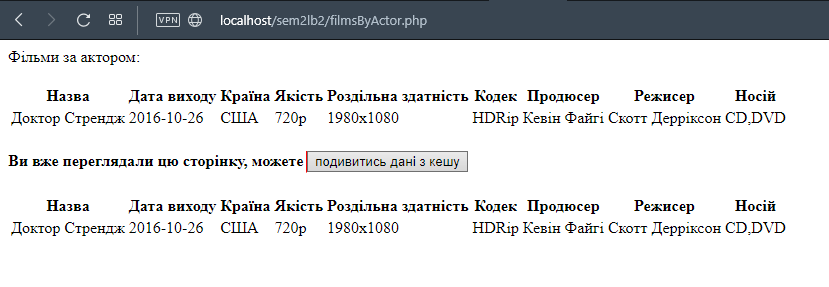
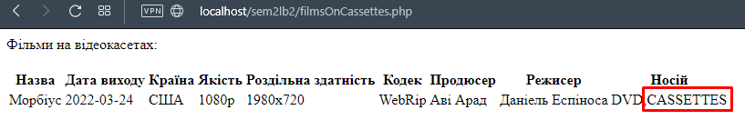
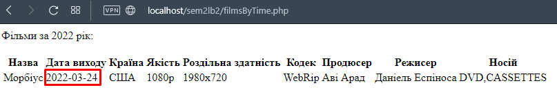

Вариант 4. Создать и заполнить БД домашней фильмотеки, содержащей информацию про имеющиеся фильмы, сериалы, мультсериалы и т.д. Объекты фильмотеки описываются названием, годом выхода, типом носителя (видеокассета, CD, DVD, BR) и произвольным набором параметров, среди которых режиссер, актеры (может быть больше одного), жанр (может быть больше одного), страна выпуска и т.д.

Предоставить пользователю возможность получения следующей информации:

- что можно посмотреть на видеокассетах;
- в каких фильмах участвовал выбранный актер;
- что посмотреть из нового (вышедшее в этом году).

Скриншоты:

- начальная страница приложения

- выбор фильма по актеру

- результат выбора фыльма по актеру первый раз

- сохраненные данные по актеру в localStorage

- вывод сохраненных данных после нажатия на кнопку

- результат выбора фыльма на кассетах:

- результат выбора фыльма за 2022 год:

