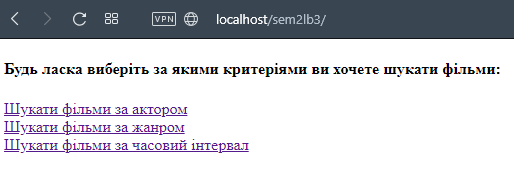
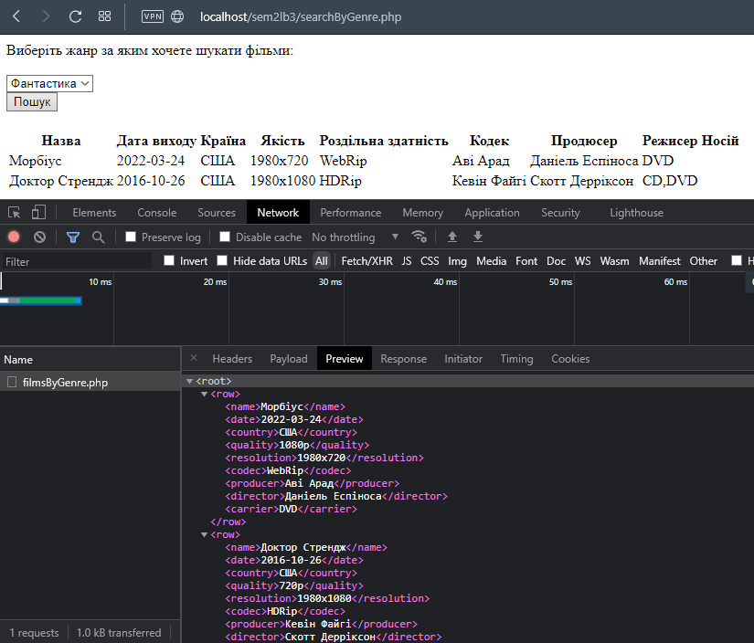

Вариант 4. Создать и заполнить произвольными данными БД для хранения информации о фильмотеке.

Для фильма задается название, жанр (может быть более чем один), год выхода, страна, качество, тип носителя (видеокассета, CD, DVD, BR). Для цифровых носителей определяется разрешение в пикселях и типы применяемых кодеков. Также для фильма может задаваться дополнительная информация, такая как: продюсер, режиссер и актеры (произвольное количество).

Сформировать запросы и вывести результаты:

- список фильмов выбранного жанра;
- список фильмов с выбранным актером;
- список фильмов за указанный временной интервал.

Скриншоты:

- начальная страница приложения

- результат выбора фыльма по актеру в формате простого текста

- результат выбора фыльма по жанру в формате XML

- результат выбора фыльма по времени

**Для выбора фыльма по времени и по актеру используются вместо XMLHttpRequest методов Fetch API для запроса, служащего примером работы с форматом JSON**